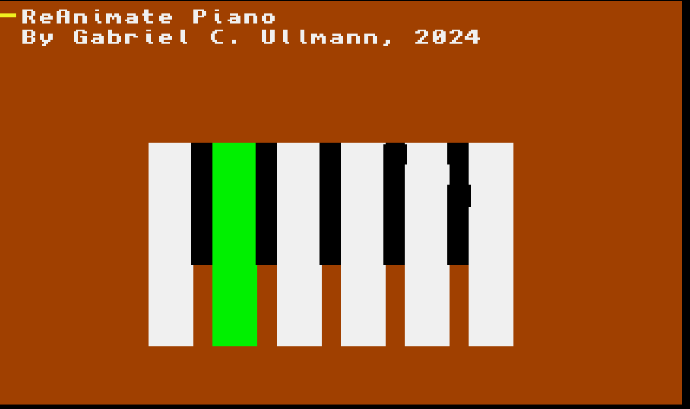

# ReAnimate Piano

By Gabriel C. Ullmann, 2024

This is a very basic piano application I wrote in AMOS BASIC for [Reanimate 2024](https://reanimate.school). I wrote it using [AMOS Pro Unity](https://github.com/AmiDARK/AmosProfessionalUnity-Official-Releases) running in the [WinUAE](https://www.winuae.net/) Amiga Emulator.

In this repository, you can find my original code, plus the improved version by Yann-Gaël Guéhéneuc.
